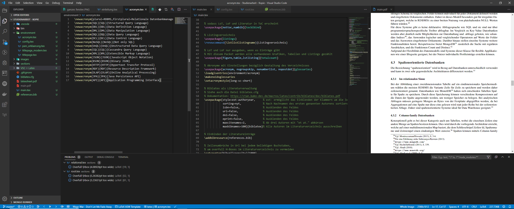

Template
===========

Dieses Projekt stellt eine Hilfestellung zur Erfüllung des Leitfadens der [ASW - Berufsakademie Saarland e.V.](https://www.asw-berufsakademie.de/) dar.
Es kann das Setup für wissenschaftliche Arbeiten jeglicher Art erleichtern, indem es eine grobe Struktur und einige Voreinstellungen festlegt und den Fokus der Nutzung auf das Verfassen der Arbeit selbst richtet.
Zudem wird ein modernes Titelblatt zur Verfügung gestellt, welches sich durch ausfüllen von Variablen konfigurieren lässt.

Das Projekt ist unter der [Creative-Common-Lizenz 3](http://creativecommons.org/licenses/by-sa/3.0/de/) veröffentlicht.


Installation
============

### TeX-Distribution

Um eine Arbeit in LaTeX zu schreiben muss eine Distribution auf dem Rechner installiert sein.

Das Template wurde mit [TeX Live](https://www.tug.org/texlive/) entwickelt. Daher wird diese Distribution für die Arbeit mit dieser Vorlage empfohlen.


### Entwicklungsumgebung

*   LaTeX funktioniert auch ganz ohne Entwicklungsumgebung über die Kommandozeile.
*   Overleaf, ein Online LaTeX-Editor (mit eingeschränkter Funktionalität)
*   Visual Studio Code
    *   Extensions: [LaTeX Workshop](https://marketplace.visualstudio.com/items?itemName=James-Yu.latex-workshop) und [Spell Check](https://marketplace.visualstudio.com/items?itemName=streetsidesoftware.code-spell-checker-german)
    *   Im Template befindet sich .vscode/settings.json für Einstellungen für diese beiden Extensions (wird automatisch erkannt und eingelesen)
    * Die PDF lässt sich mittels Shorcut builden (Default: Strg+shift+B)
    * Hier mal ein Einblick:


Erste Schritte
==============

### LaTeX Einstieg

Als blutiger Anfänger lohnt es sich zuerst über Tutorials Wissen zum Thema anzueignen. 
Ein gutes Beispiel hierfür ist die [Serie von Overleaf](https://de.overleaf.com/learn/latex/How_to_Write_a_Thesis_in_LaTeX_(Part_1):_Basic_Structure).


### Projekt

Über GitHub kann das Repository zu einem eigenen Projekt geforkt werden (erfordert einen Account) oder als .zip heruntergeladen werden. 
Dies kann dann als lokales Projekt entpackt oder aber auf Overleaf hochzuladen werden.
Als erster Schritt ist es sinnvoll aus dem Projekt in dem aktuellen Zustand eine PDF erfolgreich zu generieren.


### Projekteinstellungen

Die ersten Änderungen sollten in der environment/config.tex getätigt werden. 
Hier können Informationen zur Arbeit hinterlegt und Konfigurationen bezüglich der Darstellung getroffen werden.
Somit kann das Titelblatt auf ein modernes Aussehen konfiguriert werden und sieht wie folgt aus

Des Weiteren dient diese Datei um das Präambel manuell um arbeitsspezifische Einstellungen zu erweitern.


### Struktur anlegen

Es ist empfehlenswert jedes Kapitel in eine eigene Datei auszulagern und die Struktur in sections/root festzulegen.
  


Tipps
=====

### Allgemeine Hinweise

Dem Projekt ist ein LaTeX-Cheatsheet beigelegt, in dem viele nützliche Hinweise aller Art beschrieben sind.


### Tabellengenerierung

[TablesGenerator.com](http://tablesgenerator.com/) bietet ein Onlinetool zur Tabellengenerierung auch für LaTeX-Code, mit dem man auch Tabellen in verschiedene Formate umwandeln kann.


### Listings

Es gibt verschiedene Wege ein Listing zu erstellen:

```latex
% Hier wird der Inhalt von command.txt eingelesen und als Listing dargestellt
\lstinputlisting[label=lst:label2,caption=Another listing]{command.txt}

% Dies ist ein Beispiel für eine Listing-Umgebung, 
% bei der der Code komplett in einer .tex Datei steht
\begin{lstlisting}[caption={Hello World},language=C]
#include<stdio.h>

int main(int argc,char **argv)
{
  printf("Hello World!\n");
  return(0);
}
\end{lstlisting}
```

Zu manchen Sprachen gibt es keinen direkten Support, wie zum Beispiel für JavaScript.
Um diesen hinzuzufügen muss folgender Code im Präambel stehen. ([Referenz](https://tex.stackexchange.com/questions/89574/language-option-supported-in-listings))
```latex
% Beispiel mit Farb-Codierung
\usepackage{color}
\definecolor{lightgray}{rgb}{.9,.9,.9}
\definecolor{darkgray}{rgb}{.4,.4,.4}
\definecolor{purple}{rgb}{0.65, 0.12, 0.82}
\definecolor{green}{rgb}{0.4, 0.6, 0.3}
\lstdefinelanguage{JavaScript}{
  keywords={class, interface, typeof, new, true, false, catch, function, return, null, catch, switch, var, if, in, while, do, else, case, break},
  keywordstyle=\color{blue}\bfseries,
  ndkeywords={export, string, number, boolean, throw, implements, import, this},
  ndkeywordstyle=\color{darkgray}\bfseries,
  identifierstyle=\color{black},
  sensitive=false,
  comment=[l]{//},
  morecomment=[s]{/*}{*/},
  commentstyle=\color{green}\ttfamily,
  stringstyle=\color{red}\ttfamily,
  morestring=[b]',
  morestring=[b]"
}

% Voreinstellungen für Listings
\lstset{
  language=JavaScript,
  backgroundcolor=\color{lightgray},
  extendedchars=true,
  basicstyle=\footnotesize\ttfamily,
  showstringspaces=false,
  showspaces=false,
  numbers=left,
  numberstyle=\footnotesize,
  numbersep=9pt,
  tabsize=2,
  breaklines=true,
  showtabs=false,
  captionpos=b,
  % https://tex.stackexchange.com/questions/39640/typesetting-utf8-listings-with-german-umlaute
  literate=
    {Ö}{{\"O}}1
    {Ä}{{\"A}}1
    {Ü}{{\"U}}1
    {ß}{{\ss}}1
    {ü}{{\"u}}1
    {ä}{{\"a}}1
    {ö}{{\"o}}1
    {~}{{\textasciitilde}}1
    {…}{{\ldots}}1
  }
```

### Abkürzungsverzeichnis

Das Template verwendet das Paket glossaries für die Verwaltung der Abkürzungen.

Diese werden in environment/acronym.tex definiert:

```latex
% Die Definitionen der Plurale sind optional
% {key}{Abkürzung}{Langform}
\newacronym[plural=RDBMS,firstplural=relationale Datenbankmanagementsysteme]{RDBMS}{RDBMS}{relationales Datenbankmanagementsystem}
```

Im Text können die Abkürzungen folgendermaßen verwendet werden

```latex
% Gibt bei der ersten Verwendung die Langform m aus und die Abkürzung in Klammern.
% Danach die Abkürzung. 
% \gls{key}
\gls{RDBMS} 
-> relationales Datenbankmanagementsystem (RDBMS)

% wie \gls aber erster Buchstabe wird groß geschrieben.
\Gls{RDBMS} 
-> Relationales Datenbankmanagementsystem (RDBMS)

% gibt die Pluralform aus
\glspl{RDBMS} 
-> relationale Datenbankmanagementsysteme (RDBMS)

% Pluralform + erster Buchstabe groß
\Glspl{RDBMS} 
-> Relationale Datenbankmanagementsysteme (RDBMS)

% Gibt unabhängig vorheriger Verwendung nur die Langform aus.
\acrlong{RDBMS} 
-> relationales Datenbankmanagementsystem

% Gibt unabhängig vorheriger Verwendung die Abkürzung aus.
\acrshort{RDBMS} 
-> RDBMS

% Gibt unabhängig vorheriger Verwendung die Langform und anschließender Abkürzung aus.
\acrfull{RDBMS} 
-> relationales Datenbankmanagementsystem (RDBMS)
```


### Literaturverzeichnis

Die Angaben in dem .bib-Format sollten immer überprüft werden

*   Alle [Pflichtfelder](http://bib-it.sourceforge.net/help/fieldsAndEntryTypes.php) ausfüllen
*   Bei der Angabe von Pages sollte "--" stehen
*   Wenn man für einzelne Literaturverweise eine andere Bezeichnung für "Bd" (Band) und "Nr" (Nummer) haben möchte kann man die Felder in eine Notiz umformen, die am Ende des Eintrags angezeigt wird.
*   Der Leitfaden erfordert, dass bei Zitaten aus Sammelbändern sowohl das direkt zitierte Werk, als auch das Sammelwerk ins Literaturverzeichnis aufgenommen werden. Das Template bietet hierfür keine Hilfestellung. Man muss folglich beide Einträge manuell vornehmen.
  


Kontakt
=======

Wenn Probleme auftreten können gerne GitHub-Issues aufgemacht werden.

Für Fragen stehe ich gerne zur Verfügung und bin über die E-Mail-Adresse [leonrheinert@gmail.com](mailto:leonrheinert@gmail.com) erreichbar.